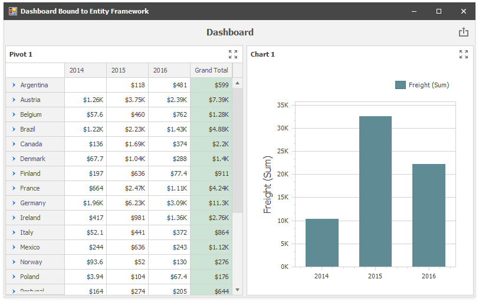

<!-- default badges list -->

<!-- default badges end -->
# BI Dashboard for WinForms - Bind a Dashboard to an Entity Framework Data Source in code

The following example demonstrates how to bind a dashboard to the SQLite database using Entity Framework 6.

In this example, the [DashboardEFDataSource](https://docs.devexpress.com/Dashboard/DevExpress.DashboardCommon.DashboardEFDataSource) class is used to connect the dashboard to the Entity Framework data source.

## Files to Review

* [Form1.cs](./CS/Dashboard_EntityFramework/Form1.cs) (VB: [Form1.vb](./VB/Dashboard_EntityFramework/Form1.vb))
* [OrdersContext.cs](./CS/Dashboard_EntityFramework/OrdersContext.cs) (VB: [OrdersContext.vb](./VB/Dashboard_EntityFramework/OrdersContext.vb))

## Documentation

* [Entity Framework Data Source](https://docs.devexpress.com/Dashboard/113909)

## More Examples

* [ASP.NET MVC Dashboard - How to bind a dashboard to an Entity Framework Data Source](https://github.com/DevExpress-Examples/aspnet-mvc-dashboard-how-to-bind-a-dashboard-to-an-entity-framework-data-source-t551381)
<!-- feedback -->
## Does this example address your development requirements/objectives?

 

(you will be redirected to DevExpress.com to submit your response)
<!-- feedback end -->
